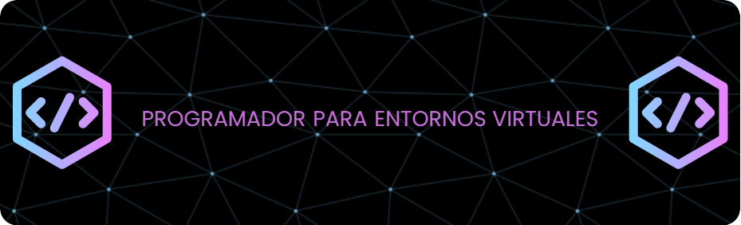

	
    

Estudiante de Ingeniería en Tecnologías de la Información, con especialidad en Entornos Virtuales y Negocios Digitales.
Responsable y comprometida en demostrar las habilidades adquiridas en el área tecnológica, con una destacada capacidad de adaptación a diversos entornos y situaciones. Apasionada por el aprendizaje continuo y la ampliación de conocimientos, especialmente interesada en el emprendimiento digital. Busco aplicar mis conocimientos en tecnología y negocios digitales para contribuir al crecimiento de proyectos innovadores y al desarrollo de soluciones digitales efectivas.

  

## 👩‍🎓Formación Académica
🎓 T.S.U Área Entornos Virtuales y Negocios Digitales.

🎓 Ingeniería en Entornos Virtuales y Negocios Digitales.

## 🗣️ Idiomas
🗨️ Inglés A2 

🗨️ Español Nativo

## 👩‍💻Habilidades
  	    	     

## 👩‍💻Proyectos
## Sitio web “El Botanero”. 
Donde se realizó la arquitectura de software y se llevo a cabo el levantamiento de requerimientos funcionales y no funcionales,  diagramas UML, narrativas de casos de uso,  manual de desarrollador y manual de usuario. 
#### Colaboración:
Ing. Itzman Leonel Heredia Manrrique.  

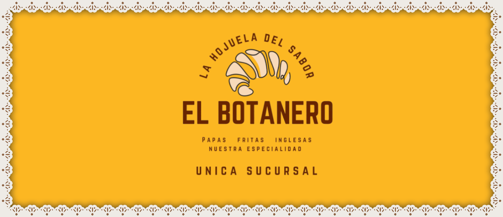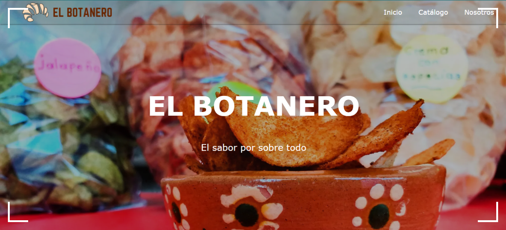
## Aplicación de realidad aumentada “Conociendo México”. 
Donde se realizó para fines educativos para el conocimiento de las costumbres, tradiciones, flora y fauna de cada estado del país de México gracias a la generación y planificación de bocetos y recursos  multimedia.
#### Colaboración:
Ing. Leonardo López Vega.  

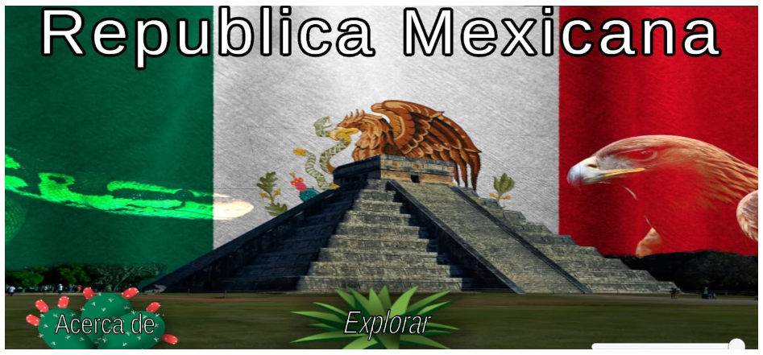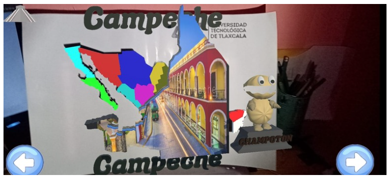

## Aplicación móvil “Abecedario Otomí”. 
Creada en Flutter. Para la elbaoración de abecedario Otomí con recursos visuales y de audio para el aprendizaje. 

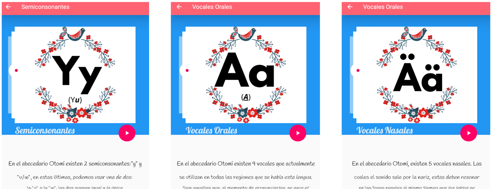

## Halloween 
Modelado 3D creado en Blender con temática de Halloween.  

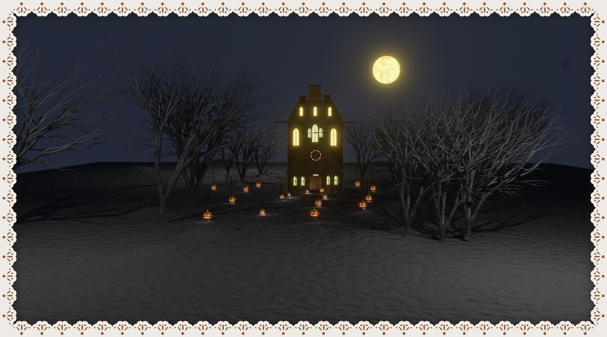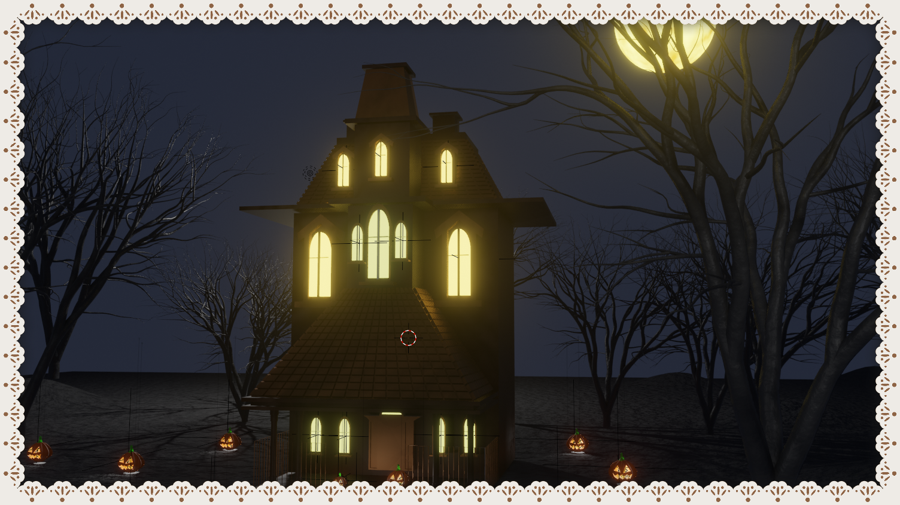

## Barca de la Fé 
Modelado 3D creado en Blender, de la Iglesia La Barca de la Fe, ubicada en el municipio de Tlaxco, Tlaxcala. 

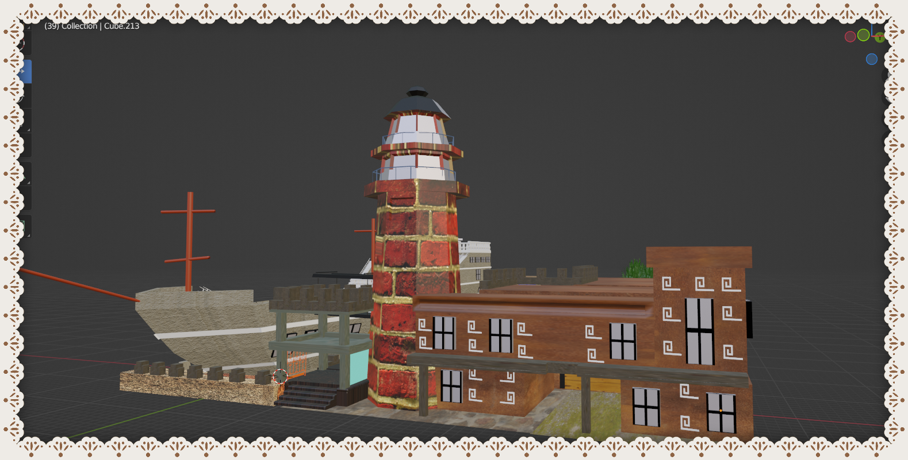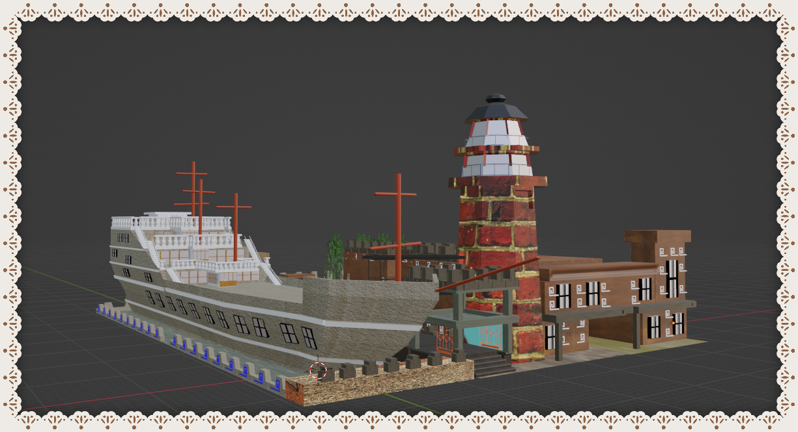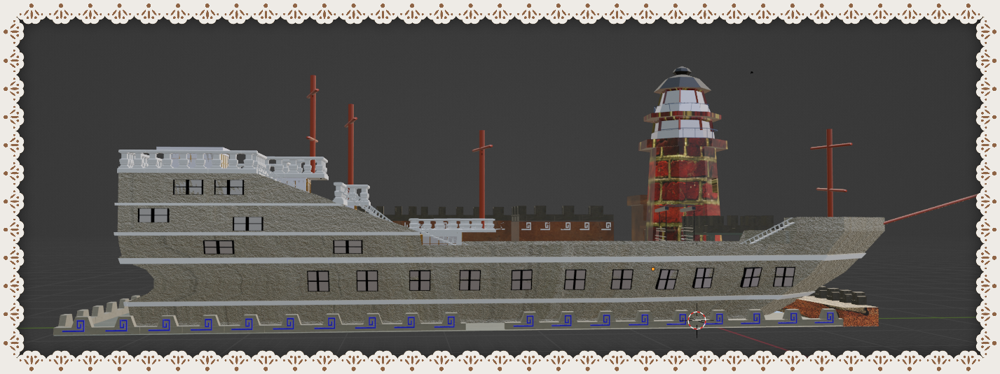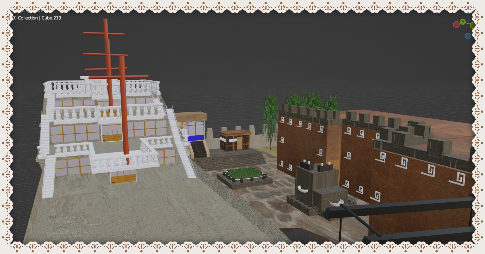

